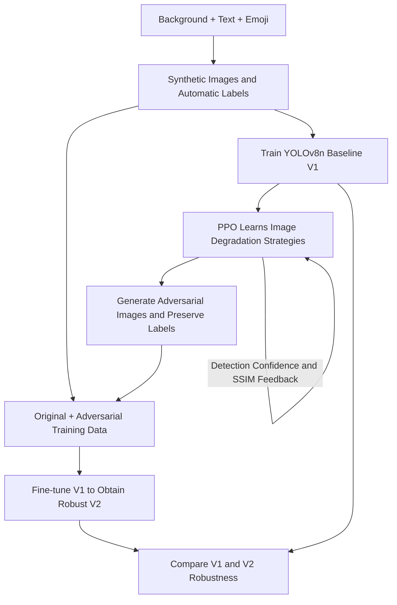

# Social Sensing in the Dark: Robust Emoji Detection with Adversarial Reinforcement Learning

Using reinforcement learning to generate challenging image degradations and improve YOLO's ability to detect emojis in low-quality images, providing visual cues for implicit sentiment analysis.

## Background

Social media users often express emotion through a combination of images, text, and emojis. Adding different emojis to the same image can convey approval, doubt, or sarcasm.

As these images are captured, resized, and repeatedly shared, they can become blurry, noisy, or lose fine details. Even when people can still recognize the emojis, detectors trained on clean images may miss them.

This project asks: **How can a model continue to locate and recognize emojis as image quality deteriorates?**

## Methodology and Workflow

The framework combines a **YOLOv8n detector** with a **PPO reinforcement learning agent** in a train–attack–retrain workflow.

### 1. Build synthetic data and a baseline detector

Randomly resize and place **10 emoji classes** on solid-color or noisy backgrounds, then add short text overlays to create meme-like images.

The generator automatically records each emoji's class and bounding box in YOLO format. An **80% / 20% training–validation split** is used to develop the baseline detector, V1.

### 2. Learn image degradation strategies

Train a **PPO agent** to select sequences of blur, noise, darkening, pixelation, and local occlusion that reduce the detector's confidence in the target emoji class.

The reward balances two objectives:

- **Attack effectiveness:** Reward reductions in target-class detection confidence.
- **Structural preservation:** Use the Structural Similarity Index (SSIM) to penalize excessive image degradation.

### 3. Improve the detector with adversarial examples

Preserve the original class and bounding-box annotations for the generated images, and combine them with the original training data.

Starting from V1's weights, fine-tune for **10 epochs** to obtain the robust detector, V2. Compare both models under PPO-generated perturbations.

## Results

The PPO attack evaluation in the project report shows a substantial improvement in detection stability on degraded images.

| Metric | Baseline V1 | Robust V2 |
|---|---:|---:|
| Attack Success Rate (ASR) ↓ | 80.00% | **0.00%** |
| Median Detection Confidence under Attack ↑ | Approx. 0.00 | **Approx. 0.99** |
| Validation mAP@50 ↑ | 99.50% | **99.50%** |

ASR is the proportion of evaluated images whose target-class detection confidence falls **below 0.2** after the attack.

Under this experimental setup, adversarial training reduces ASR by **80 percentage points** while maintaining high validation detection performance. The results suggest that PPO-generated hard examples can effectively supplement the training data.

> These results come from synthetic data and a specific PPO attack setup. A 0% ASR means no successful attacks were observed in that evaluation; it does not imply robustness to every type of degradation. The project predicts emoji classes and locations. Full image sentiment understanding also requires text and visual context.

## Project Files

The implementation is located in `Let-Yolo-Dectect-Social-Sensing-in-the-Dark/` within this repository.

| File | Purpose |
|---|---|
| `download_emojis.py` | Downloads emoji image assets for synthetic data generation. |
| `dataset_generator.py` | Composites backgrounds, text, and emojis; generates bounding-box labels. |
| `split_data.py` | Organizes generated images and labels into training and validation sets. |
| `data.yaml` | Defines dataset paths, training sources, and the 10 emoji classes. |
| `train_defense.py` | Fine-tunes pretrained YOLOv8n to build the baseline detector V1. |
| `attack_env.py` | Implements the Gymnasium environment, image perturbations, confidence feedback, and SSIM penalties. |
| `train_attacker.py` | Trains the PPO agent against the baseline detector. |
| `generate_adv_data.py` | Generates perturbed training images and copies their original annotations. |
| `retrain_defense.py` | Fine-tunes V1 on the configured dataset to obtain V2. |
| `evaluate_attack.py` | Compares V1 and V2 under attack and exports evaluation data and plots. |
| `generate_extra_plots.py` | Plots SSIM and confidence distributions from the evaluation CSV. |
| `test_attack.py` | Tests random perturbations on a single image for debugging. |

`assets/emojis/` contains the source emoji images, and `yolov8n.pt` provides the pretrained detector weights. The included `runs_v2/detect/emoji_defense_model_v2/` directory contains V2 checkpoints, training metrics, and validation visualizations.

Generated images are organized in `dataset/` and `yolo_dataset/`; attack evaluation outputs are written to `results_comparison/`. Large generated datasets are not bundled with the repository.

## License

Distributed under the [MIT License](LICENSE).
